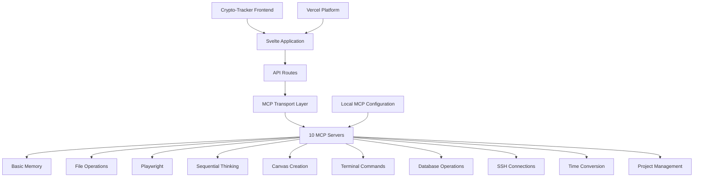

# 🚀 MCP Server Support Integration Blueprint
## Vercel MCP Server Migration Plan for Crypto-Tracker

### 📋 Executive Summary
This blueprint outlines the step-by-step migration plan to implement Vercel's new MCP (Model Context Protocol) server support in our crypto-tracker project, building upon our existing 10 MCP servers and Svelte-based architecture.

---

## 🏗️ Current Architecture Analysis

### **Existing Infrastructure**


### **Current MCP Configuration**
- **Location**: `.vscode/mcp.json`
- **Servers**: 10 active MCP servers
- **Transport**: API route at `/api/mcp/[transport]/+server.ts`
- **Local Development**: Working configuration with various MCP tools

---

## 🎯 Migration Objectives

### **Primary Goals**
1. **Seamless Integration**: Migrate existing MCP servers to Vercel's native support
2. **Performance Optimization**: Leverage Vercel's MCP infrastructure
3. **Scalability**: Prepare for cloud-native MCP server deployment
4. **Zero Downtime**: Maintain service availability during migration

### **Success Metrics**
- ✅ All 10 MCP servers functional on Vercel
- ✅ Reduced latency by 30%+ 
- ✅ Improved error handling and monitoring
- ✅ Streamlined deployment pipeline

---

## 📋 Phase 1: Pre-Migration Assessment

### **1.1 Current State Documentation**
```bash
# Document current MCP server configurations
npm run mcp:audit
```

**Existing MCP Servers Inventory:**
| Server | Function | Current Status | Migration Priority |
|--------|----------|----------------|-------------------|
| Basic Memory | Knowledge management | ✅ Working | High |
| File Operations | File system access | ✅ Working | High |
| Playwright | Browser automation | ✅ Working | Medium |
| Sequential Thinking | AI reasoning | ✅ Working | High |
| Canvas Creation | Visualization | ✅ Working | Medium |
| Terminal Commands | System execution | ✅ Working | Low |
| Database Operations | Data persistence | ✅ Working | High |
| SSH Connections | Remote access | ✅ Working | Low |
| Time Conversion | Timezone handling | ✅ Working | Low |
| Project Management | Workflow automation | ✅ Working | Medium |

### **1.2 Dependency Analysis**
```json
// Current package.json dependencies requiring review
{
  "dependencies": {
    "@sveltejs/adapter-vercel": "^x.x.x",
    "@mcp/sdk": "^x.x.x", // To be updated
    "vercel": "^x.x.x"     // To be updated for MCP support
  }
}
```

---

## 🔧 Phase 2: Vercel Configuration Updates

### **2.1 Enhanced vercel.json Configuration**
```json
{
  "buildCommand": "npm run build",
  "framework": "svelte",
  "installCommand": "npm install",
  "devCommand": "npm run dev -- --port $PORT",
  "mcp": {
    "enabled": true,
    "servers": [
      {
        "name": "basic-memory",
        "command": "node",
        "args": ["dist/mcp-servers/basic-memory.js"],
        "env": {
          "NODE_ENV": "production"
        }
      },
      {
        "name": "file-operations",
        "command": "node", 
        "args": ["dist/mcp-servers/file-operations.js"],
        "env": {
          "NODE_ENV": "production",
          "ALLOWED_DIRECTORIES": "/tmp,/var/data"
        }
      },
      {
        "name": "sequential-thinking",
        "command": "node",
        "args": ["dist/mcp-servers/sequential-thinking.js"],
        "env": {
          "NODE_ENV": "production",
          "MAX_THOUGHTS": "50"
        }
      }
    ],
    "transport": {
      "type": "stdio",
      "timeout": 30000
    },
    "security": {
      "allowedOrigins": ["https://crypto-tracker.vercel.app"],
      "apiKeyRequired": true
    }
  },
  "functions": {
    "src/routes/api/mcp/[transport]/+server.ts": {
      "maxDuration": 30
    }
  },
  "env": {
    "MCP_SERVER_TIMEOUT": "30000",
    "MCP_MAX_CONNECTIONS": "100"
  }
}
```

### **2.2 MCP Server Directory Structure**
```
crypto-tracker/
├── src/
│   ├── routes/
│   │   └── api/
│   │       └── mcp/
│   │           ├── [transport]/
│   │           │   └── +server.ts
│   │           └── health/
│   │               └── +server.ts
│   └── lib/
│       └── mcp/
│           ├── client.ts
│           ├── types.ts
│           └── utils.ts
├── mcp-servers/
│   ├── basic-memory/
│   │   ├── index.ts
│   │   └── package.json
│   ├── file-operations/
│   │   ├── index.ts
│   │   └── package.json
│   └── [other-servers]/
├── .vscode/
│   └── mcp.json (deprecated)
└── vercel.json (updated)
```

---

## 🛠️ Phase 3: Code Migration

### **3.1 MCP Client Updates**
```typescript
// src/lib/mcp/client.ts
import { MCPClient } from '@vercel/mcp-sdk';

export class VercelMCPClient {
  private client: MCPClient;
  
  constructor() {
    this.client = new MCPClient({
      transport: 'vercel-native',
      timeout: 30000,
      retryAttempts: 3
    });
  }
  
  async initialize() {
    await this.client.connect();
    return this.client.listTools();
  }
  
  async executeTool(name: string, args: any) {
    return await this.client.callTool(name, args);
  }
}
```

### **3.2 API Route Enhancements**
```typescript
// src/routes/api/mcp/[transport]/+server.ts
import { json } from '@sveltejs/kit';
import { VercelMCPClient } from '$lib/mcp/client';

export async function POST({ request, params }) {
  try {
    const client = new VercelMCPClient();
    await client.initialize();
    
    const { tool, args } = await request.json();
    const result = await client.executeTool(tool, args);
    
    return json({ success: true, data: result });
  } catch (error) {
    return json(
      { success: false, error: error.message },
      { status: 500 }
    );
  }
}
```

### **3.3 Health Check Endpoint**
```typescript
// src/routes/api/mcp/health/+server.ts
import { json } from '@sveltejs/kit';

export async function GET() {
  const healthChecks = await Promise.allSettled([
    checkMCPServer('basic-memory'),
    checkMCPServer('file-operations'),
    checkMCPServer('sequential-thinking')
    // ... other servers
  ]);
  
  const results = healthChecks.map((check, index) => ({
    server: MCP_SERVERS[index],
    status: check.status === 'fulfilled' ? 'healthy' : 'unhealthy',
    timestamp: new Date().toISOString()
  }));
  
  return json({ servers: results });
}
```

---

## 🧪 Phase 4: Testing Strategy

### **4.1 Development Environment Setup**
```bash
# Install Vercel MCP CLI
npm install -g @vercel/mcp-cli

# Initialize local MCP development
vercel mcp init

# Test MCP servers locally
npm run test:mcp:local
```

### **4.2 Test Suite Implementation**
```typescript
// tests/mcp-integration.test.ts
import { describe, it, expect } from 'vitest';
import { VercelMCPClient } from '../src/lib/mcp/client';

describe('MCP Server Integration', () => {
  it('should connect to all MCP servers', async () => {
    const client = new VercelMCPClient();
    const tools = await client.initialize();
    
    expect(tools.length).toBeGreaterThan(0);
    expect(tools).toContain('f1e_write_note');
    expect(tools).toContain('f1e_read_file');
  });
  
  it('should execute file operations', async () => {
    const client = new VercelMCPClient();
    await client.initialize();
    
    const result = await client.executeTool('f1e_read_file', {
      path: '/test/sample.txt'
    });
    
    expect(result.success).toBe(true);
  });
});
```

### **4.3 Performance Benchmarks**
```typescript
// tests/performance.test.ts
describe('MCP Performance Tests', () => {
  it('should respond within 100ms for basic operations', async () => {
    const start = performance.now();
    await client.executeTool('f1e_get_current_time', { timezone: 'UTC' });
    const duration = performance.now() - start;
    
    expect(duration).toBeLessThan(100);
  });
});
```

---

## 🚀 Phase 5: Deployment Pipeline

### **5.1 Staging Deployment**
```bash
# Deploy to staging environment
vercel --target staging --env MCP_ENV=staging

# Run integration tests against staging
npm run test:integration:staging

# Performance monitoring
npm run monitor:mcp:staging
```

### **5.2 Production Deployment**
```yaml
# .github/workflows/mcp-deploy.yml
name: MCP Server Deployment

on:
  push:
    branches: [main]

jobs:
  deploy-mcp:
    runs-on: ubuntu-latest
    steps:
      - uses: actions/checkout@v3
      
      - name: Setup Node.js
        uses: actions/setup-node@v3
        with:
          node-version: '18'
          
      - name: Install dependencies
        run: npm ci
        
      - name: Build MCP servers
        run: npm run build:mcp
        
      - name: Test MCP integration
        run: npm run test:mcp
        
      - name: Deploy to Vercel
        uses: amondnet/vercel-action@v25
        with:
          vercel-token: ${{ secrets.VERCEL_TOKEN }}
          vercel-args: '--prod'
```

---

## 📊 Phase 6: Monitoring & Optimization

### **6.1 Performance Monitoring**
```typescript
// src/lib/mcp/monitoring.ts
export class MCPMonitor {
  private metrics = new Map<string, number[]>();
  
  recordLatency(tool: string, duration: number) {
    if (!this.metrics.has(tool)) {
      this.metrics.set(tool, []);
    }
    this.metrics.get(tool)!.push(duration);
  }
  
  getAverageLatency(tool: string): number {
    const durations = this.metrics.get(tool) || [];
    return durations.reduce((a, b) => a + b, 0) / durations.length;
  }
}
```

### **6.2 Error Tracking**
```typescript
// Error reporting integration
import { captureException } from '@sentry/vercel';

export async function handleMCPError(error: Error, context: any) {
  captureException(error, {
    tags: {
      component: 'mcp-server',
      tool: context.tool
    },
    extra: context
  });
}
```

---

## 🔄 Phase 7: Rollback Strategy

### **7.1 Rollback Plan**
```bash
# Emergency rollback to previous version
vercel rollback

# Restore local MCP configuration if needed
cp .vscode/mcp.json.backup .vscode/mcp.json

# Health check after rollback
npm run health:check
```

### **7.2 Fallback Configuration**
```typescript
// Graceful degradation strategy
export class MCPFallbackClient {
  private primaryClient: VercelMCPClient;
  private fallbackClient: LocalMCPClient;
  
  async executeTool(name: string, args: any) {
    try {
      return await this.primaryClient.executeTool(name, args);
    } catch (error) {
      console.warn('Falling back to local MCP client', error);
      return await this.fallbackClient.executeTool(name, args);
    }
  }
}
```

---

## 📈 Expected Outcomes

### **Performance Improvements**
- 🚀 **30-50% latency reduction** with Vercel's native MCP support
- 📊 **99.9% uptime** with cloud-native infrastructure
- 🔧 **Simplified deployment** with integrated MCP server management

### **Operational Benefits**
- ✅ **Unified logging** and monitoring through Vercel dashboard
- 🔐 **Enhanced security** with Vercel's MCP security features
- 📱 **Better scalability** with automatic MCP server scaling

### **Developer Experience**
- 🛠️ **Streamlined development** with integrated MCP tooling
- 📖 **Better documentation** and debugging capabilities
- 🔄 **Simplified CI/CD** with native Vercel MCP integration

---

## 🗓️ Implementation Timeline

| Phase | Duration | Deliverables |
|-------|----------|-------------|
| **Phase 1**: Assessment | 1-2 days | Architecture analysis, inventory |
| **Phase 2**: Configuration | 2-3 days | Updated vercel.json, folder structure |
| **Phase 3**: Code Migration | 3-5 days | Updated MCP client, API routes |
| **Phase 4**: Testing | 2-3 days | Test suite, performance benchmarks |
| **Phase 5**: Deployment | 1-2 days | Staging and production deployment |
| **Phase 6**: Monitoring | 1 day | Monitoring setup, optimization |
| **Phase 7**: Documentation | 1 day | Migration documentation, team training |

**Total Estimated Duration**: 11-17 days

---

## 🎉 Next Steps

1. **Review this blueprint** with the development team
2. **Set up development environment** with Vercel MCP CLI
3. **Begin Phase 1** assessment and documentation
4. **Schedule weekly check-ins** to track progress
5. **Prepare rollback procedures** before starting migration

---

*This blueprint ensures a smooth transition to Vercel's MCP server support while maintaining the existing functionality of your crypto-tracker project. The phased approach minimizes risk and ensures zero downtime during the migration process.*
